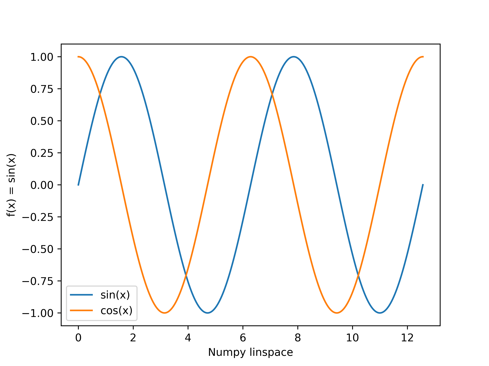
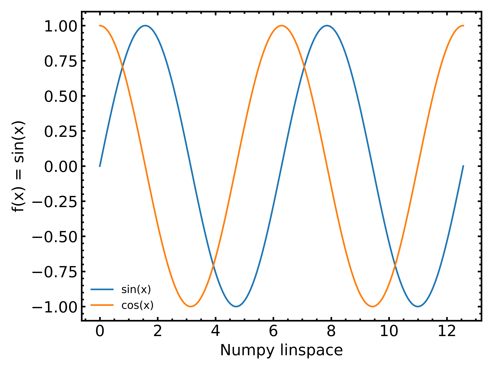
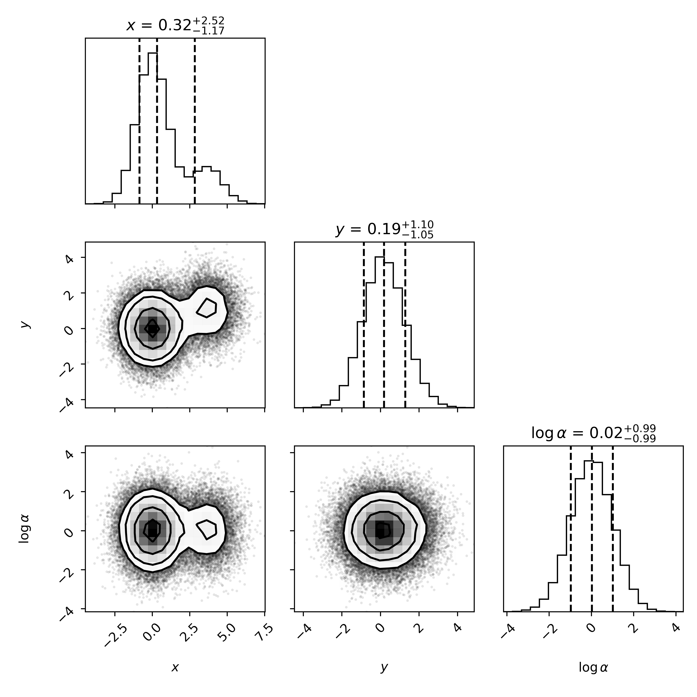
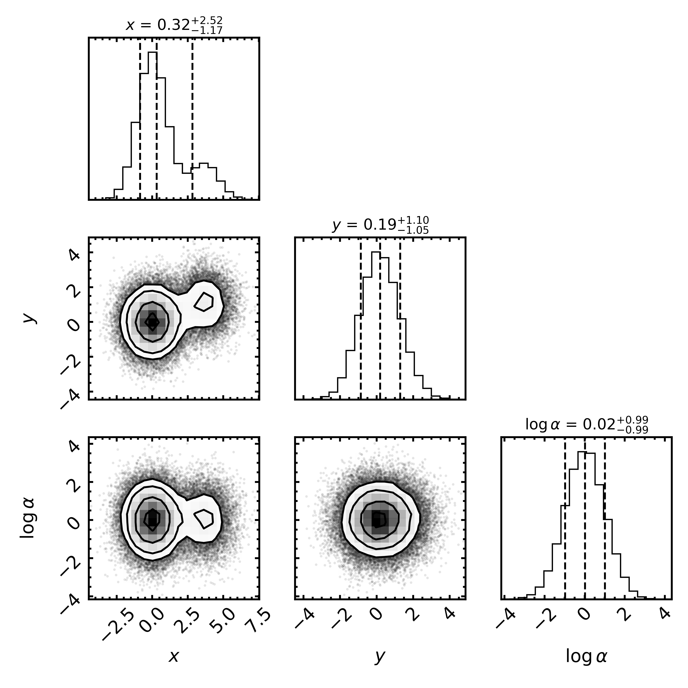

# Matplotlib plotting styles

A repository for my preferred matplotlib stylesheet (custom), to homogenise 
Python plotting routines.

## General plots
The standard matplotlib plotting 
style setup produces a plot looking like this



For my preferred plot settings, I include (among other things) minor and 
major tick labels, larger axis and tick label sizes, a `tight_layout()` 
plot setting, thicker axis and tick lines, and a legend with no border.



To use one of the style-sheets stored here, the easiest solution is to 
include the following code-snippet before creating plots in a script

```
plt.style.use("https://raw.githubusercontent.com/simon-ast/matplotlib-plot-style/main/default_style.mplstyle")
```

The link within `plt.style.use` is for the raw `*.mplstyle` file from 
within this repository.

## Corner plots
Very similar to the style above, but with easier adjustments for future use. 





```
plt.style.use("https://raw.githubusercontent.com/simon-ast/matplotlib-plot-style/main/corner_style.mplstyle")
```

The top tick marks in the marginalised posterior plots can removed by setting

```
corner_figure.axes[rel_idx].tick_params(which="both", top=False)
```
where `rel_idx` points to the subplots in the main diagonal.